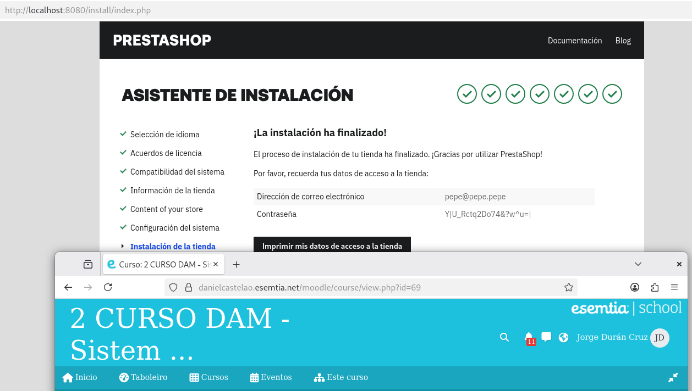
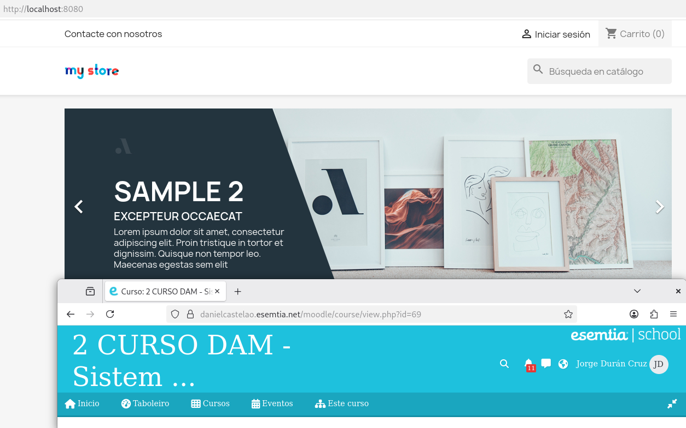
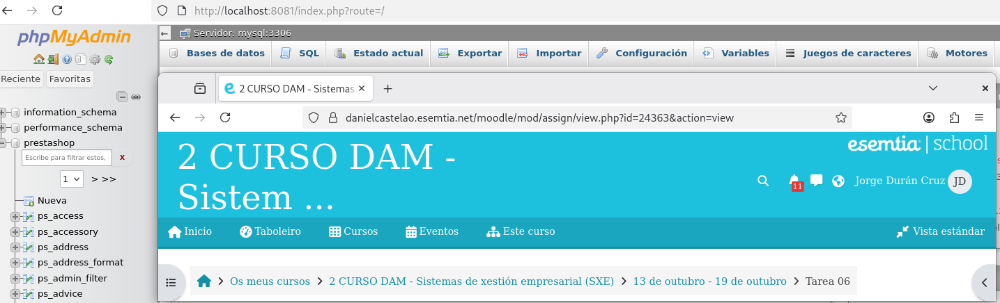

# Tarea 6

## Archivo compose

Primero debemos crear un archivo compose como el siguiente:
```
services:
  # Servicio para MySQL
  mysql:
    image: mysql:8.0
    container_name: mysql-prestashop
    restart: unless-stopped
    environment:
      MYSQL_ROOT_PASSWORD: ${MYSQL_ROOT_PASSWORD}
      MYSQL_DATABASE: ${MYSQL_DATABASE}
      MYSQL_USER: ${MYSQL_USER}
      MYSQL_PASSWORD: ${MYSQL_PASSWORD}
    volumes:
        - Mysql_data:/var/lib/mysql  # Persistencia de datos, no se debe borrar
    healthcheck:
      test: ["CMD", "mysqladmin", "ping", "-h", "localhost"]
      interval: 10s
      retries: 5
      start_period: 10s

  # Servicio para PrestaShop
  prestashop:
    image: prestashop/prestashop:latest
    container_name: prestashop
    restart: unless-stopped
    environment:
      DB_HOST: mysql
      DB_NAME: ${DB_NAME}
      DB_USER: ${DB_USER}
      DB_PASSWORD: ${MYSQL_PASSWORD}


    ports:
      - "8080:80"
    volumes:
      - Prestashop:/var/www/html  # Persistencia de datos, no se debe borrar
    depends_on:
        mysql:
          condition: service_healthy

  # Servicio para phpMyAdmin
  phpmyadmin:
    image: phpmyadmin/phpmyadmin:latest
    container_name: phpmyadmin
    restart: unless-stopped
    environment:
      PMA_HOST: ${PMA_HOST}
      PMA_PORT: ${PMA_PORT}
      MYSQL_ROOT_PASSWORD: ${MYSQL_ROOT_PASSWORD}
    ports:
      - "8081:80"
    depends_on:
      mysql:
        condition: service_healthy
volumes:
  Mysql_data:
  Prestashop:


```
Los detalles más importantes son: 

`volumes` que sirven para que haya persistencia de datos y se guarden los datos cuando borres los contenedores y los vuelvas a ejecutar.

`environment` que son las variables que usaran los contenedores para crearse.

`image` que indica la imagen que usa cada contenedor.

`ports` que indican mediante que puertos de la máquina anfitriona conectaran con qué contenedores.

`healthcheck` que realiza una comprobación de que el contenedor se ejecutó de manera correcta.

`depends on` que marca que el contenedor no se puede ejecutar hasta que otro contenedor funcione para evitar errores de conexión entre los contenedores.

En este caso los parámetros del environment no están escritos directamente, esto es por seguridad. Las variables se escriben en un fichero .env de la siguiente manera:

```MYSQL_ROOT_PASSWORD=admin
MYSQL_DATABASE=prestashop
MYSQL_USER=admin
MYSQL_PASSWORD=admin

DB_NAME=prestashop
DB_USER=admin
DB_PASSWD=admin

PMA_HOST=mysql
PMA_PORT=3306

```
De esta manera, si los archivos están en la misma carpeta, el archivo de compose buscara los datos en este archivo que suele guardarse de manera local y no subirse a la nube.

## Muestra de los servicios

Una vez iniciemos los contenedores deberíamos poder acceder a las siguientes páginas desde un navegador.

### Prestashop



Si es la primera vez que se ejecuten los contenedores necesitamos instalar primero prestashop con un asistente.
Cuando veamos la pantalla de la imagen significará que ya podemos abrir la página normal de prestashop.



### PhpMyAdmin



En la página de PhpMyAdmin podemos acceder a todas las tablas que ha creado prestashop.